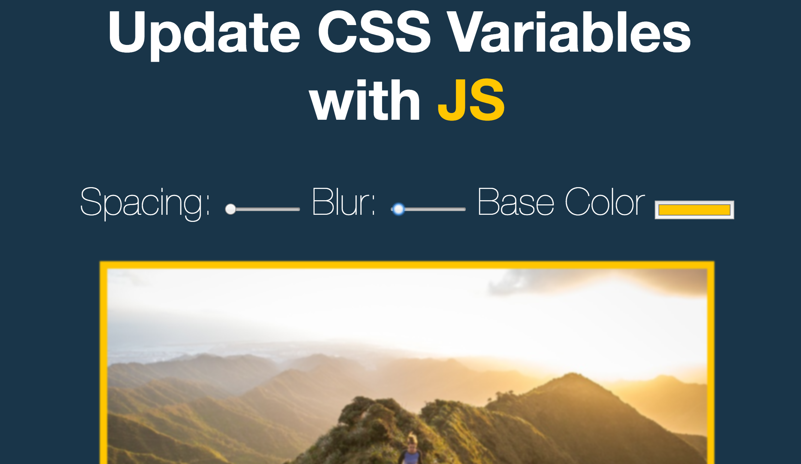

> This is a JavaScript practice with [JavaScript30](https://javascript30.com/) by [Wes Bos](https://github.com/wesbos) without any frameworks, no compilers, no boilerplate, and no libraries.

# 03 - CSS Variables and Js

view demo [here](https://claudz1.github.io/Js30/03-CSSVariables/index.html)

***Lessons Learnt***: `:root`, CSS Variables definition var(--xxx), filter: blur(), change event and mousemove event

CSS Variables can be updated with Javascript.
### CSS :root selector

- The `:root` selector matches the document's root element, which is always the **html element**.

### CSS Variables

The standard way of writing css variables by using doubles dashes i.e. `--` in front of the variable
`--spacing`.

- The CSS Variables declaration syntax is `--` similar to `$` in SASS
- To use the variable we use `var()`
  - `var(--spacing)`

-  CSS filter provides filter effects such as lur,greyscale take a look [here](https://developer.mozilla.org/en-US/docs/Web/CSS/filter).
### Javascript part
- `querySelectorAll() `returns a `NodeList` and not an Array of elements

  - NodeList has all indexing,`forEach()`, `keys()` but does not have the wide variety of methods that we get with an array such as `map(), pop(), filter()` etc..

### data-* attributes
- we can have additional info associated with our html elements by using user defined attributes by using `data attibutes`.
- We can access data attributes by using the dataset API which puts them into an object for us to access.

### Accessing root element
- documentElement gives us the root node of the document
- we can set the styles for a particular element using `setProperty` 

