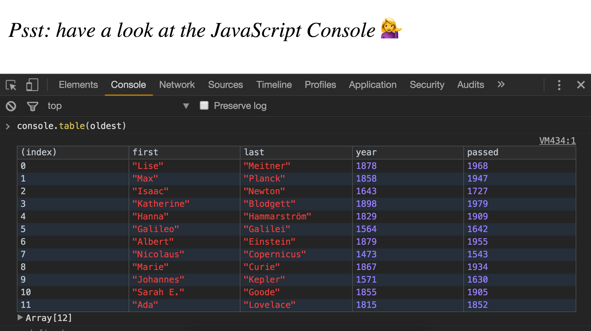

>This is a JavaScript practice with [JavaScript30](https:\\javascript30.com) by [Wes Bos]() without any frameworks, no compilers, no boilerplate, and no libraries.

# 04 - Array cardio day 1

***Lessons learnt*** :Array methods such as `filter()`, `  map()`, `reduce()`, `sort()`, `console.table()`

### Higher  order functions
filter map reduce sort are called higher order functions which help in writing better Javascript  functional code 

### filter()

- It's a method available on the Array object which helps us to filter the array by passing in a callback function as an argument and loop over each object in the array
- When we return true we keep it and dont need to explicitly mention return false
- Returns a new  array  with the elements that pass the test.If no elements pass the test an empty array is returned. [Read more here](https://developer.mozilla.org/en-US/docs/Web/JavaScript/Reference/Global_Objects/Array/filter)

### map()

- The map() method calls a callback function once for each element in an array in order, and constructs a new array from the results. 
- It returns the same amount of items as we give it.[Read more here](https://developer.mozilla.org/en-US/docs/Web/JavaScript/Reference/Global_Objects/Array/map)

### sort()

- Takes in a function and sorts it based on the code provided To make code shorter use ternary operator `if a? b :c`

### reduce()

- The reduce() executes the callback function once for each element present in the array to reduce the array to a single value
-  **Use it when** :You have an array of amounts and want to add them up
  - arr.reduce(callback, initValue);

We can call the queryselector on any existing dom element and doesn't always have to be document

### Convert NodeList into Array

- We can convert a NodeList into an array by using `Array.from()`
- Or we can also use the `spread operator `
```
  Array.from(category.querySelectorAll('a'));

  [...category.querySelectorAll('a')]
```