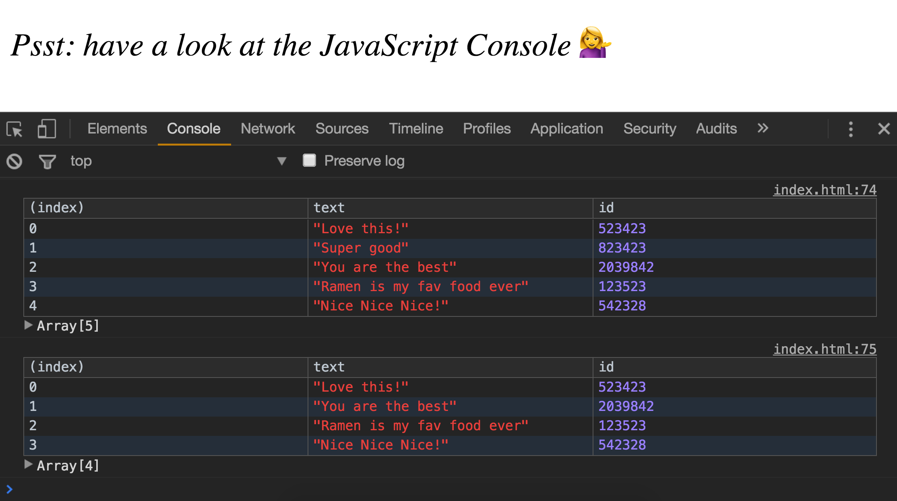

> This is a JavaScript practice with [JavaScript30](https://javascript30.com/) by [Wes Bos](https://github.com/wesbos) without any frameworks, no compilers, no boilerplate, and no libraries.

# 07 - Array Cardio

 ### `.some` and `.every`
- Array.prototype.some() will check if at least one thing in our array meets what we are looking for takes in a function and checks it for every single element
- checks if every element fulfills the condition

### `find()` `findIndex()`
- find is like filter but instead returns just the one we are looking for
- findindex can be used to find the element at a particular position
```
const newComments =[
      comments.slice(0,index),
      comments.slice(index+1)
    ];
```
- take a copy of the comments before the index i.e.`comments.slice(0,index),` and after the index `comments.slice(index+1)`

